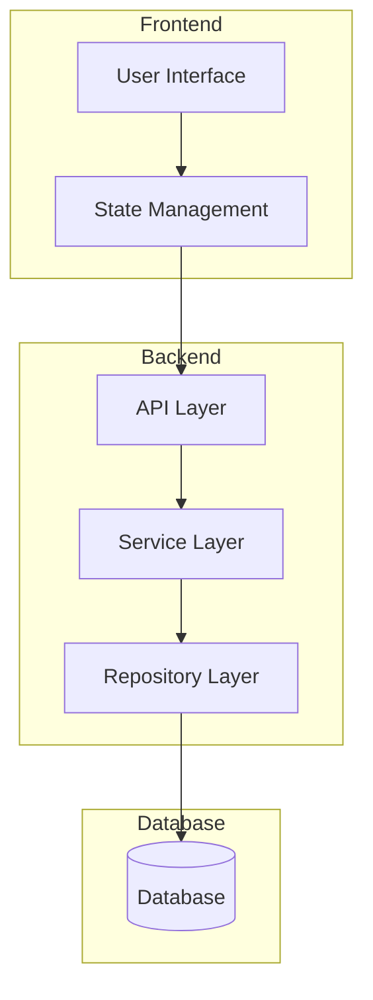
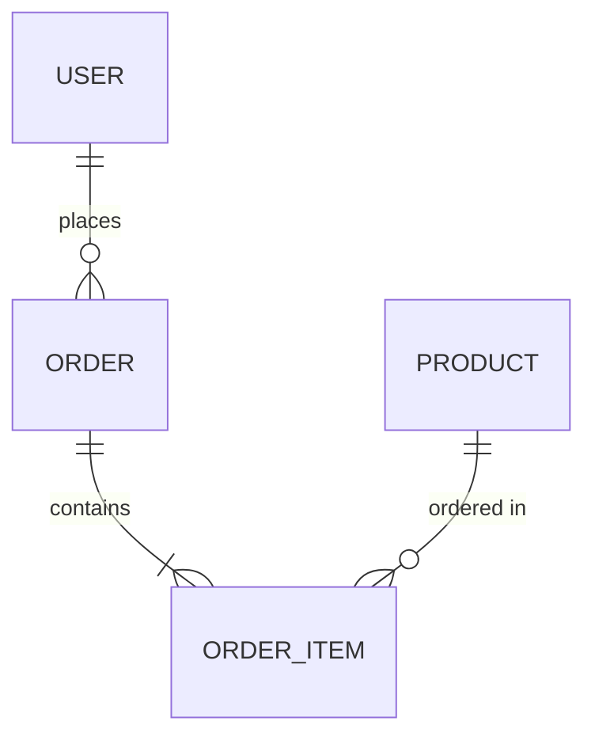
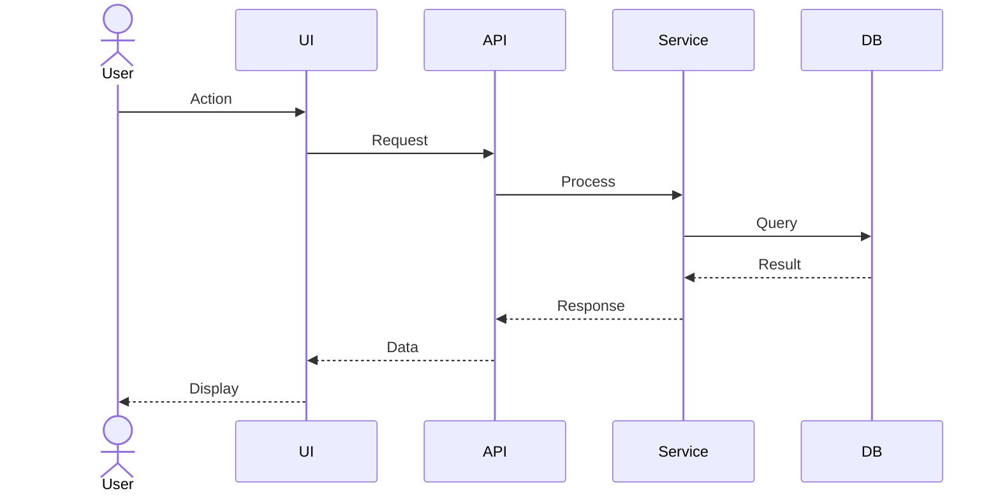
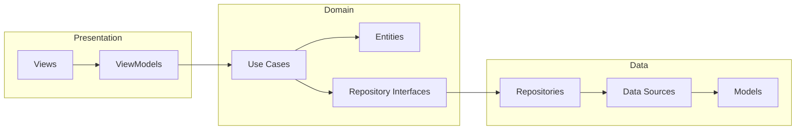
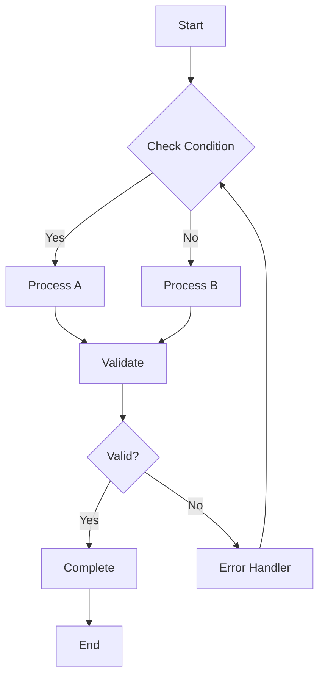
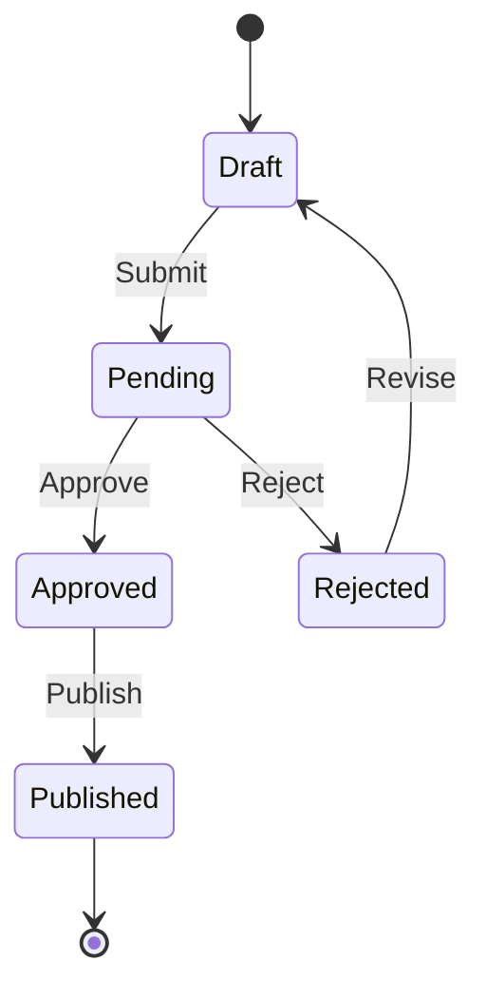

# Project Documentation Generator

Scan your project and generate essential documentation.

## Step 1: Scan Project

First, analyze the project structure:

1. **Read architecture docs** (if exists):
   ```
   ~/.claude/architecture/
   .claude/architecture/
   ```

2. **Scan project structure**:
   - Identify project type (frontend, backend, fullstack, mobile)
   - Identify tech stack
   - List main modules/features
   - Identify APIs/endpoints
   - Identify data models/entities

3. **Output scan results**:
   ```markdown
   ## Project Scan Results

   ### Project Info
   - Type: [frontend/backend/fullstack/mobile]
   - Stack: [detected stack]
   - Architecture: [detected pattern]

   ### Modules/Features Found
   - Module 1: [description]
   - Module 2: [description]

   ### APIs/Endpoints
   - GET /api/...
   - POST /api/...

   ### Data Models
   - Entity 1
   - Entity 2
   ```

---

## Step 2: Ask User - What to Generate?

Present options to user:

```
Which documentation do you want to generate?

1. 📊 Diagrams
   - System Architecture Diagram
   - Database ER Diagram
   - Sequence Diagrams
   - Component Diagram

2. 📋 Use Case Specifications
   - Actor definitions
   - Use case descriptions
   - Pre/post conditions
   - Main/alternative flows

3. 🔄 Workflow Documentation
   - Business process flows
   - State machine diagrams
   - User journey maps
   - Data flow diagrams

4. 📚 All of the above
```

---

## Step 3: Generate Selected Documentation

### Option 1: Diagrams

Generate using Mermaid syntax:

#### System Architecture Diagram


#### Database ER Diagram


#### Sequence Diagram


#### Component Diagram


---

### Option 2: Use Case Specifications

Generate for each feature:

```markdown
# Use Case: [Name]

## Overview
- **ID**: UC-001
- **Name**: [Use Case Name]
- **Actor**: [Primary Actor]
- **Description**: [Brief description]

## Preconditions
- [ ] Condition 1
- [ ] Condition 2

## Postconditions
- [ ] Success outcome 1
- [ ] Success outcome 2

## Main Flow
1. Actor does X
2. System responds with Y
3. Actor does Z
4. System completes action

## Alternative Flows

### A1: [Alternative Name]
- Trigger: [when this happens]
- Steps:
  1. Step 1
  2. Step 2
- Resume: [where to resume in main flow]

### A2: [Another Alternative]
- Trigger: [when this happens]
- Steps:
  1. Step 1
- Resume: [where to resume]

## Exception Flows

### E1: [Error Name]
- Trigger: [error condition]
- Steps:
  1. System shows error
  2. Actor acknowledges
- End state: [how it ends]

## Business Rules
- BR1: [Rule description]
- BR2: [Rule description]

## UI Requirements
- Screen: [Screen name]
- Components: [List of UI components]
```

---

### Option 3: Workflow Documentation

#### Business Process Flow


#### State Machine


#### User Journey Map
```markdown
# User Journey: [Feature Name]

## Persona
- Name: [User type]
- Goal: [What they want to achieve]

## Journey Stages

### 1. Discovery
- Action: [What user does]
- Touchpoint: [Where it happens]
- Emotion: [How they feel]
- Pain points: [Frustrations]

### 2. Consideration
- Action: [What user does]
- Touchpoint: [Where it happens]
- Emotion: [How they feel]
- Pain points: [Frustrations]

### 3. Decision
- Action: [What user does]
- Touchpoint: [Where it happens]
- Emotion: [How they feel]
- Pain points: [Frustrations]

### 4. Action
- Action: [What user does]
- Touchpoint: [Where it happens]
- Emotion: [How they feel]
- Pain points: [Frustrations]

### 5. Retention
- Action: [What user does]
- Touchpoint: [Where it happens]
- Emotion: [How they feel]
- Pain points: [Frustrations]
```

---

## Output Location

Ask user where to save documentation:

1. **Project docs folder**: `./docs/`
2. **Architecture folder**: `./.claude/docs/`
3. **Custom location**: User specified

## File Structure
```
docs/
├── diagrams/
│   ├── architecture.md
│   ├── database-er.md
│   └── sequences/
│       └── [feature]-sequence.md
├── use-cases/
│   └── [feature]-usecase.md
└── workflows/
    ├── business-flows.md
    ├── state-machines.md
    └── user-journeys.md
```

---

## Quick Reference

### Diagram Types
| Type | Purpose | Tool |
|------|---------|------|
| Architecture | System overview | Mermaid graph |
| ER Diagram | Database schema | Mermaid erDiagram |
| Sequence | Interactions | Mermaid sequenceDiagram |
| Flowchart | Process flow | Mermaid flowchart |
| State | State transitions | Mermaid stateDiagram |

### When to Use
| Doc Type | Best For |
|----------|----------|
| Diagrams | Visual overview, onboarding |
| Use Cases | Feature requirements, testing |
| Workflows | Process documentation, automation |
