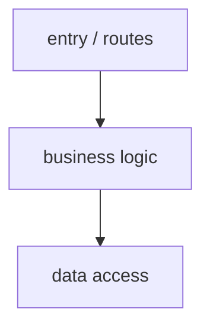

# Documentation Workflow

One skill, two depths: hand-author a single doc, or batch-generate a whole docs site.

## Pick your mode

| Situation | Mode | Jump to |
|-----------|------|---------|
| Authoring / updating a specific doc with opinionated prose | **SINGLE** | [Mode SINGLE](#mode-single) |
| Re-generating the whole `docs/` site from current code | **FULL** | [Mode FULL](#mode-full) |

- ❌ Just need API reference from OpenAPI → use `/feature-build` (API mode), Phase 4
- ❌ Understand the codebase, not document it → use `/research-explore` (ONBOARDING)

## Read the project first (both modes)

Detect stack via `~/.claude/architecture/_shared/stack-detection.md`. Then see `~/.claude/architecture/_shared/read-project-first.md`: **docs must describe the architecture the code ACTUALLY has** — derive structure, layers, and flows by scanning the code, never from a DDD template. Read `ddd-architecture.md` only if the project is genuinely DDD.

---
---

# Mode SINGLE

Hand-author project docs (README, API.md, ARCHITECTURE.md, CONTRIBUTING.md) with full control over voice and structure.

## When to use
- ✅ Authoring or updating a specific document
- ✅ Need opinionated prose, not just structure
- ✅ Doc is small / scoped — a single file or section
- ❌ Want automated multi-doc generation → **Mode FULL**

## Workflow

```
SCAN → ANALYZE → GENERATE → REVIEW (loop)
```

## Phase 1: SCAN

```bash
tree -L 3 -I 'node_modules|vendor|dist|build'
find . -maxdepth 3 -name "*.md" -o -name "README*"
```

Identify what needs work: README, API.md, ARCHITECTURE.md, CONTRIBUTING.md, setup/deployment/runbook, DB schema, config reference.

### Gate
- [ ] Architecture doc read · Existing docs inventoried · Gaps identified, priorities set

## Phase 2: ANALYZE

For each doc define: **Purpose** (what problem it solves), **Audience** (new contributor / API consumer / on-call), **Source** (which code feeds it).

### Required sections per doc type

**README.md** — one-line description + badges · quick start (≤5 commands) · tech stack (link to architecture) · common commands · project structure (top 2 levels) · links to other docs

**API.md** — auth method + credentials · base URL per env · per endpoint (method, path, request, response, errors, example) · pagination (one block) · error format (one block) · rate limits, versioning

**ARCHITECTURE.md** — one mermaid diagram of the REAL structure · list of the main parts (modules / features / packages) with 1-line responsibility · how they communicate (events / calls / imports — if applicable) · key tech decisions with rationale · link to `~/.claude/architecture/<stack>.md` (only if the project follows it)

**CONTRIBUTING.md** — local dev setup (≤5 steps) · branch + commit conventions · PR flow + review expectations · test commands + coverage · where to ask for help

### Gate
- [ ] Each doc has purpose, audience, source · Required sections listed · Aligned with architecture doc

## Phase 3: GENERATE

### Rules
- **Use real code from the repo** — never invent examples
- **Link to architecture docs**, don't duplicate them
- **Code blocks must be runnable** — copy verbatim from working files
- **Diagrams** — mermaid; one per major concept
- **Tables** for any list with >3 parallel items

### Minimal skeletons

**README.md** (≤80 lines for most projects)
```markdown
# {Project Name}
> One-line value proposition.
## Quick Start
`{install}` then `{run}`
## Tech Stack
- {language + version}, {framework}, {DB / queue}  → see [ARCHITECTURE.md](./ARCHITECTURE.md)
## Commands
| Command | Purpose |
## Docs
- [API.md](./API.md) · [ARCHITECTURE.md](./ARCHITECTURE.md) · [CONTRIBUTING.md](./CONTRIBUTING.md)
```

**API.md** (per-endpoint block)
```markdown
### POST /resource
Create a resource. Idempotent via `Idempotency-Key` header.
**Auth:** Bearer
**Request** `{ "field": "value" }`
**Response 201** `{ "id": "...", "field": "value" }`
**Errors:** `invalid_field` 400 · `unauthorized` 401 · `already_exists` 409
```

**ARCHITECTURE.md** opener
```markdown
# Architecture
## Overview
{1-2 paragraphs: what this system does, key constraints}
## Structure
{Diagram of the project's ACTUAL structure — layers if it's layered, a module/feature graph otherwise. The example below is layered; replace it with what you scanned.}

Link to `~/.claude/architecture/<stack>.md` only if the project follows that pattern.
## Main parts
| Module / feature / package | Responsibility |
```

**CONTRIBUTING.md** opener
```markdown
# Contributing
## Setup
`{1-5 commands}`
## Branch + Commits
- Branch: `{prefix}/{ticket}-{slug}` · Commit: Conventional Commits
## PR Flow
1. Open PR vs `{base}` → 2. CI green → 3. ≥1 review approval → 4. Squash merge
```

### Gate
- [ ] All planned docs drafted · Code examples from real files · Diagrams render · Cross-links work

## Phase 4: REVIEW

### Per-doc checklist
- [ ] Reflects current architecture (not outdated)
- [ ] All commands run as written (try them)
- [ ] All file paths exist · All endpoints / functions referenced still exist
- [ ] Internal + external links resolve · Code blocks compile · Diagrams match code

### Cross-doc consistency
- [ ] Same terminology everywhere · No duplicated info — link instead

### Loop
If any issue → return to Phase 3 for that doc, fix, re-review.

---
---

# Mode FULL

Generate a complete `docs/` site (business overview, architecture, use cases with sequence diagrams, README index) from the current codebase. Includes a 3-iteration auto-review loop.

## When to use
- ✅ Re-generate the whole `docs/` site from current code
- ✅ Existing docs have drifted; want batch sync with review loop
- ✅ Project has no structured docs at all
- ❌ Authoring a single doc by hand → **Mode SINGLE**
- ❌ Understand the codebase, not document it → `/research-explore` (ONBOARDING)

## Workflow

```
SCAN → CONFIRM mode → GENERATE → REVIEW loop (≤3x) → COMPLETE
```

## Phase 1: SCAN

```bash
find . -name "*.md" -not -path "*/node_modules/*" -not -path "*/vendor/*" -not -path "*/.dart_tool/*" | sort
ls docs/ 2>/dev/null
tree -L 4 -I 'node_modules|vendor|dist|build|.dart_tool|.git'
# Entry points per stack:
# Go: grep -r "func.*Handler" internal/  · NestJS: grep -r "@Controller\|@Get\|@Post" src/
# Laravel: cat routes/web.php routes/api.php  · Remix: ls app/routes/  · Flutter: grep -r "GoRoute" lib/
```

**Extract:** stack + framework, all domains/modules, all user-facing flows, existing docs structure.

### Gate
- [ ] Stack identified · All domains listed · All use cases listed (count + name) · Existing docs inventoried

## Phase 1.5: CONFIRM

Ask the user **explicitly** which mode:

| Mode | When to use | Effect |
|------|-------------|--------|
| **REFACTOR** | Existing docs messy / partial / wrong structure | Restructure `docs/` from scratch, may delete old files |
| **UPDATE** | Existing structure fine, content stale | Keep file paths + headings, refresh content + add missing sections |

If unsure: default to **UPDATE** (less destructive).

### Gate
- [ ] User confirmed mode · If REFACTOR: explicit OK to remove old files

## Phase 2: GENERATE

### Target structure (REFACTOR mode)

```
docs/
├── README.md              # Index linking to everything below
├── business.md            # WHAT the system does, for non-engineers
├── architecture.md        # HOW it's structured (layers + domains + tech)
├── use-cases/
│   ├── README.md          # Index of use cases
│   └── <use-case>.md      # One file per user-facing flow, with sequence diagram
├── api.md                 # If service has external API
└── runbook.md             # How to run / deploy / debug
```

### File rules
- **`docs/README.md`** — index only (≤30 lines): one-line description, link to each sub-doc, last-updated timestamp.
- **`docs/business.md`** — for non-engineers. NO API endpoints, NO code blocks, NO file paths. Cover: what problem this solves, who uses it, key user journeys (named like a PRD), success metrics. Plain language.
- **`docs/architecture.md`** — for engineers. Diagram of the real structure (mermaid), the main parts, how they communicate (if applicable), tech decisions with rationale, link to `~/.claude/architecture/<stack>.md` (only if the project follows it).
- **`docs/use-cases/<name>.md`** — one per flow: trigger (who, what), preconditions, sequence diagram (mermaid `sequenceDiagram` following the steps the code ACTUALLY takes — e.g. MVC: actor → controller → model → DB → response; DDD: actor → handler → usecase → infra → response), postconditions / side effects, errors (HTTP code + meaning).
- **`docs/api.md`** — only if external API exists. Auth, base URL, error format, pagination → then endpoint table. Deep ref → link to OpenAPI spec.
- **`docs/runbook.md`** — for ops/on-call: local dev (≤5 commands), deploy steps, common failures + recovery, monitoring dashboards + log queries.

### Mermaid rules
Sequence diagrams for use cases · class diagrams only when ER is non-obvious · validate syntax · ≤7 actors per sequence (split if more).

### Gate
- [ ] All target files written · business.md has zero code/endpoints · Every use case has a sequence diagram · README links to every file · All file paths resolve

## Phase 3: REVIEW LOOP (≤3 iterations)

For each iteration:
- **3.1 Structure** — all target files exist · README links resolve · no duplicate content
- **3.2 Business** — plain language (no `API`/`JSON`/`class`/file paths) · covers all top-level journeys
- **3.3 Architecture** — diagram matches the code's real structure · every main part (module / feature) has a table row
- **3.4 Use cases** — one file per identified use case · each has trigger/preconditions/sequence/postconditions/errors · diagrams render
- **3.5 Consistency** — same terminology everywhere · no nonexistent file paths / endpoints referenced

**Loop:** any check fails → fix that section, restart the relevant subset. Max 3 iterations; if still failing → report what's blocking + ask user.

## Phase 4: COMPLETE

```markdown
## Docs Sync Complete
### Mode: {REFACTOR / UPDATE}
### Files: Created {N} · Updated {N} · Deleted {N — REFACTOR only}
### Coverage: Domains {N/N} · Use cases {N/N} · Diagrams {N}
### Review iterations: {1/2/3}
### Next steps: review business.md with product · validate use-cases with leads · set up doc lint in CI
```

---
---

## Hard Rules (both modes)

- **Real examples only** — invented code drifts and lies.
- **Link, don't duplicate** — refer to architecture docs, don't restate rules.
- **Test every command** before publishing.
- **Update the doc when you change the code** — stale docs are worse than no docs.
- **SINGLE:** opinionated prose, full voice control.
- **FULL:** business.md is for humans (strip jargon, no code/paths); one use case per file; mermaid only if it renders; **REFACTOR mode requires explicit user OK** — never delete docs without confirmation; max 3 review iterations.

## Related Skills

| When | Use |
|------|-----|
| Document a newly added API endpoint | `/feature-build` (API mode), Phase 4 |
| Onboard self / new dev | `/research-explore` (ONBOARDING) |
| Architecture itself needs review | `/review-code` (ARCHITECT mode) |
| Write blog / social content | `/marketing-content` |

## Recommended Agents

| Phase | Agent | Purpose |
|-------|-------|---------|
| SCAN | `@clean-architect` | Identify doc needs / structure + patterns (any architecture) |
| ANALYZE / GENERATE (API) | `@api-designer` | API doc structure + accuracy |
| ANALYZE / GENERATE (DB) | `@db-designer` | Database doc structure + accuracy |
| GENERATE | `@docs-writer` | Write all docs |
| REVIEW | `@code-reviewer` | Verify accuracy vs code |
