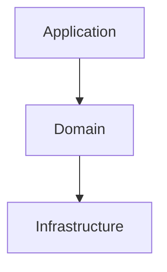
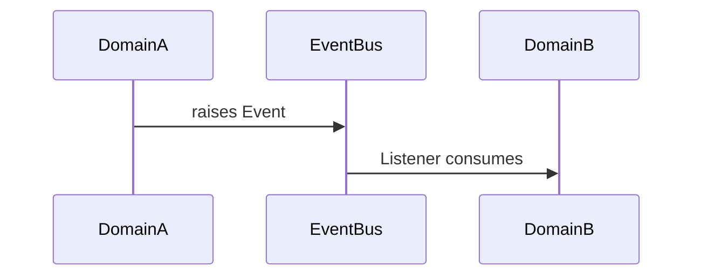

# Documentation Workflow

Author project documentation manually following stack conventions. **Use this when you want full control** over the output (README, API.md, ARCHITECTURE.md, CONTRIBUTING.md). For automated batch generation with review loop, use `/docs:sync` instead.

## When to use this skill

- ✅ Authoring or updating a specific document (README, API, ARCHITECTURE, CONTRIBUTING)
- ✅ Need to write opinionated prose, not just structure
- ✅ Doc is small / scoped — a single file or section
- ❌ Want fully automated multi-doc generation → use `/docs:sync`
- ❌ Just need API reference from OpenAPI spec → use `/feature:api` Phase 4

---

## Workflow

```
SCAN → ANALYZE → GENERATE → REVIEW (loop)
```

## Read Architecture First

Before writing, read:
1. `~/.claude/architecture/ddd-architecture.md` (core)
2. Stack-specific doc (see Stack Detection below)
3. `.claude/architecture/` for project overrides (if any)

**Documentation must accurately reflect the architecture and patterns used in the codebase.**

### Stack Detection
| File | Doc |
|------|-----|
| `go.mod` | `go-backend.md` |
| `package.json` + NestJS dep | `nodejs-nestjs.md` |
| `package.json` + Vite config | `react-frontend.md` |
| `remix.config.*` | `remix-fullstack.md` |
| `composer.json` | `laravel-backend.md` |
| `pubspec.yaml` | `flutter-mobile.md` |

---

## Phase 1: SCAN

**Goal:** identify what needs documentation.

### Actions
1. Read architecture doc for the stack
2. Scan codebase:
   ```bash
   tree -L 3 -I 'node_modules|vendor|dist|build'
   find . -maxdepth 3 -name "*.md" -o -name "README*"
   ```
3. Identify documentable items:
   - README (project overview)
   - API documentation (endpoints, schemas)
   - ARCHITECTURE (system design, layer rules)
   - CONTRIBUTING (dev setup, PR flow, conventions)
   - Setup / deployment guides
   - Database schema
   - Configuration reference

### Gate
- [ ] Architecture doc read
- [ ] Existing docs inventoried
- [ ] Gaps identified
- [ ] Priorities set (high → low)

---

## Phase 2: ANALYZE

**Goal:** define what each document MUST contain.

For each doc:
- **Purpose** — what problem does this doc solve?
- **Audience** — new contributor / API consumer / ops team?
- **Source** — which files / sections of the codebase feed this doc?

### Required sections per doc type

**README.md** must have:
- One-line description + badges
- Quick start (install → run in ≤5 commands)
- Tech stack (link to architecture)
- Common commands (build / test / lint / dev)
- Project structure (top 2 levels only)
- Link to ARCHITECTURE.md, CONTRIBUTING.md, API.md

**API.md** must have:
- Auth method (Bearer / OAuth / API key) + how to obtain
- Base URL per environment
- For each endpoint: method, path, request schema, response schema, error codes, example
- Pagination convention (one block, not per endpoint)
- Error response format (one block, not per endpoint)
- Rate limits, versioning policy

**ARCHITECTURE.md** must have:
- 1 mermaid diagram of the layer structure (link to `ddd-architecture.md` for rules)
- Domain list with 1-line responsibility each
- Cross-domain communication pattern (events)
- Key tech decisions (why this DB, why this queue, why this auth)
- Link to stack-specific architecture doc

**CONTRIBUTING.md** must have:
- Local dev setup (prerequisites + ≤5 steps)
- Branch / commit conventions
- PR flow + review expectations
- Test commands + coverage expectations
- Where to ask for help

### Gate
- [ ] Each doc has clear purpose, audience, source
- [ ] Required sections listed
- [ ] Aligned with architecture doc

---

## Phase 3: GENERATE

**Goal:** write each doc using actual code examples from the codebase.

### Rules
- **Use real code from the repo** — never invent examples
- **Link to architecture docs**, don't duplicate them
- **Code blocks must be runnable** — copy verbatim from working files
- **Diagrams** — use mermaid; one per major concept
- **Tables** for any list with >3 items and parallel structure (endpoints, env vars, commands)

### Skeleton — README.md

```markdown
# {Project Name}

> One-line value proposition.

[](link) [](link)

## Quick Start

```bash
{install}
{run}
```

## Tech Stack

- {language + version}
- {framework}
- {DB / queue / cache}

See [ARCHITECTURE.md](./ARCHITECTURE.md) for layer structure.

## Common Commands

| Command | Purpose |
|---------|---------|
| `{cmd}` | {what it does} |

## Project Structure

```
{top 2 levels only}
```

## Documentation

- [API.md](./API.md) — endpoint reference
- [ARCHITECTURE.md](./ARCHITECTURE.md) — system design
- [CONTRIBUTING.md](./CONTRIBUTING.md) — dev guide
```

### Skeleton — API.md

```markdown
# API Reference

**Base URL:** `https://api.example.com/v1`
**Auth:** Bearer token in `Authorization` header

## Errors

All errors return JSON:
```json
{ "error": { "code": "STRING", "message": "STRING", "details": {} } }
```

## Pagination

Cursor-based: `?cursor=<opaque>&limit=<int, default 20, max 100>`.
Response includes `pagination.next_cursor` (null if last page).

## Endpoints

### POST /resource

Create a resource.

**Request**
```json
{ "field": "value" }
```

**Response 201**
```json
{ "id": "...", "field": "value" }
```

**Errors:** 400 invalid_field, 401 unauthorized, 409 already_exists
```

### Skeleton — ARCHITECTURE.md

```markdown
# Architecture

## Overview

{1-2 paragraphs: what this system does, key constraints}

## Layer Structure



See [DDD architecture reference](~/.claude/architecture/ddd-architecture.md) for layer rules.

## Domains

| Domain | Responsibility |
|--------|----------------|
| {name} | {one line} |

## Cross-Domain Communication

Domains communicate via **domain events** (no direct imports).



## Key Decisions

| Decision | Rationale |
|----------|-----------|
| {tech / pattern} | {why} |
```

### Skeleton — CONTRIBUTING.md

```markdown
# Contributing

## Prerequisites
- {runtime + version}
- {DB / service}

## Setup
```bash
{1-5 commands}
```

## Branch & Commits
- Branch: `{prefix}/{ticket}-{slug}`
- Commit: Conventional Commits (`feat:`, `fix:`, `chore:`)

## PR Flow
1. Open PR against `{base branch}`
2. CI must pass
3. At least 1 review approval
4. Squash merge

## Tests
```bash
{test command}
```
Coverage target: {N}%

## Help
- {Slack / issue / discussion link}
```

### Gate
- [ ] All planned docs drafted
- [ ] Code examples taken from real files (no invention)
- [ ] Diagrams render (mermaid syntax valid)
- [ ] Cross-links between docs work

---

## Phase 4: REVIEW

**Goal:** verify accuracy, consistency, and clarity.

### Review checklist per doc

- [ ] Reflects current architecture (not outdated)
- [ ] All commands run as written (try them)
- [ ] All file paths exist
- [ ] All endpoints / functions referenced still exist
- [ ] Links resolve (internal + external)
- [ ] Code blocks compile / are valid syntax
- [ ] Diagrams match actual code structure

### Cross-doc consistency

- [ ] README references match other docs' content
- [ ] Same terminology used everywhere (e.g., "domain" vs "module")
- [ ] No duplicated info — link instead

### Loop
If any issue found → go back to **Phase 3** for that doc, fix, re-review.

---

## Final Report

```markdown
## Documentation Update

### Files Created / Modified
- `README.md` — {changes}
- `API.md` — {changes}
- `ARCHITECTURE.md` — {changes}
- `CONTRIBUTING.md` — {changes}

### Coverage
- [x] Project overview
- [x] API reference
- [x] Architecture
- [x] Contributing guide
- [ ] Deployment (out of scope)

### Verification
- [x] All commands tested
- [x] All links resolve
- [x] All examples compile
```

---

## Related Skills

| When | Use |
|------|-----|
| Generate full doc site from codebase automatically | `/docs:sync` |
| Document a newly added API endpoint | `/feature:api` (Phase 4) |
| Onboard yourself / new dev to the codebase | `/research:onboarding` |
| Write release notes / changelog | `release` (manually for now) |

---

## Recommended Agents

| Phase | Agent | Purpose |
|-------|-------|---------|
| SCAN | `@clean-architect` | Identify doc needs from architecture |
| ANALYZE (API) | `@api-designer` | API doc structure |
| ANALYZE (DB) | `@db-designer` | Database doc structure |
| GENERATE | `@docs-writer` | Write all docs |
| REVIEW | `@code-reviewer` | Verify accuracy against code |
| REVIEW | Stack-specific dev agent | Stack-specific review |
