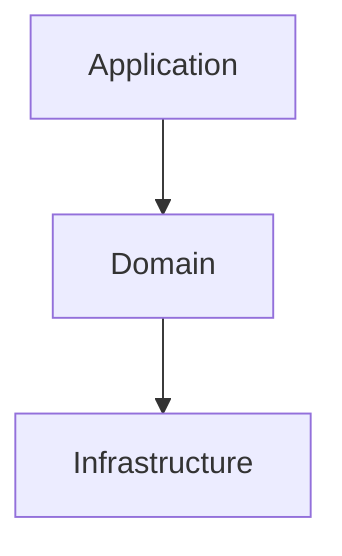

# Documentation Workflow

Hand-author project docs (README, API.md, ARCHITECTURE.md, CONTRIBUTING.md) with full control over voice and structure. For automated batch generation of a whole `docs/` tree with a review loop, use `/docs-sync` instead.

## When to use this skill

- ✅ Authoring or updating a specific document
- ✅ Need opinionated prose, not just structure
- ✅ Doc is small / scoped — a single file or section
- ❌ Want automated multi-doc generation → use `/docs-sync`
- ❌ Just need API reference from OpenAPI → use `/feature-api` Phase 4

## Read Architecture First

Detect stack via `~/.claude/architecture/_shared/stack-detection.md`. Read `ddd-architecture.md` + stack doc. Docs must reflect the architecture, not contradict it.

---

## Workflow

```
SCAN → ANALYZE → GENERATE → REVIEW (loop)
```

---

## Phase 1: SCAN

```bash
tree -L 3 -I 'node_modules|vendor|dist|build'
find . -maxdepth 3 -name "*.md" -o -name "README*"
```

Identify what needs work:
- README (project overview)
- API.md (endpoints, schemas)
- ARCHITECTURE.md (system design)
- CONTRIBUTING.md (dev setup, PR flow)
- Setup / deployment / runbook
- DB schema, config reference

### Gate
- [ ] Architecture doc read
- [ ] Existing docs inventoried
- [ ] Gaps identified, priorities set

---

## Phase 2: ANALYZE

For each doc define:
- **Purpose** — what problem does this solve?
- **Audience** — new contributor / API consumer / on-call?
- **Source** — which files / sections of the code feed this doc?

### Required sections per doc type

**README.md**
- One-line description + badges
- Quick start (≤5 commands)
- Tech stack (link to architecture)
- Common commands (build / test / lint / dev)
- Project structure (top 2 levels only)
- Link to ARCHITECTURE.md / CONTRIBUTING.md / API.md

**API.md**
- Auth method + how to obtain credentials
- Base URL per environment
- Per endpoint: method, path, request, response, errors, example
- Pagination convention (one block, not per endpoint)
- Error response format (one block, not per endpoint)
- Rate limits, versioning policy

**ARCHITECTURE.md**
- One mermaid layer diagram
- Domain list with 1-line responsibility
- Cross-domain communication pattern (events)
- Key tech decisions (DB, queue, auth) with rationale
- Link to `~/.claude/architecture/<stack>.md` for layer rules

**CONTRIBUTING.md**
- Local dev setup (prerequisites + ≤5 steps)
- Branch + commit conventions
- PR flow + review expectations
- Test commands + coverage expectations
- Where to ask for help

### Gate
- [ ] Each doc has purpose, audience, source
- [ ] Required sections listed
- [ ] Aligned with architecture doc

---

## Phase 3: GENERATE

### Rules
- **Use real code from the repo** — never invent examples
- **Link to architecture docs**, don't duplicate them
- **Code blocks must be runnable** — copy verbatim from working files
- **Diagrams** — mermaid; one per major concept
- **Tables** for any list with >3 parallel items (endpoints, env vars, commands)

### Minimal skeletons

Use these as starting points. For full templates, see `/docs-sync` (which generates the full set).

**README.md** (≤80 lines for most projects)
```markdown
# {Project Name}

> One-line value proposition.

## Quick Start
```bash
{install}
{run}
```

## Tech Stack
- {language + version}, {framework}, {DB / queue}

See [ARCHITECTURE.md](./ARCHITECTURE.md).

## Commands
| Command | Purpose |
|---------|---------|
| `{cmd}` | {what} |

## Docs
- [API.md](./API.md) · [ARCHITECTURE.md](./ARCHITECTURE.md) · [CONTRIBUTING.md](./CONTRIBUTING.md)
```

**API.md** (per-endpoint block)
```markdown
### POST /resource

Create a resource. Idempotent via `Idempotency-Key` header.

**Auth:** Bearer

**Request**
```json
{ "field": "value" }
```

**Response 201**
```json
{ "id": "...", "field": "value" }
```

**Errors:** `invalid_field` 400 · `unauthorized` 401 · `already_exists` 409
```

**ARCHITECTURE.md** opener
```markdown
# Architecture

## Overview
{1-2 paragraphs: what this system does, key constraints}

## Layers

See [DDD rules](~/.claude/architecture/ddd-architecture.md) for layer details.

## Domains
| Domain | Responsibility |
|--------|---------------|
| {name} | {one line} |
```

**CONTRIBUTING.md** opener
```markdown
# Contributing

## Setup
```bash
{1-5 commands}
```

## Branch + Commits
- Branch: `{prefix}/{ticket}-{slug}`
- Commit: Conventional Commits

## PR Flow
1. Open PR vs `{base}`
2. CI green
3. ≥1 review approval
4. Squash merge
```

### Gate
- [ ] All planned docs drafted
- [ ] Code examples taken from real files
- [ ] Diagrams render
- [ ] Cross-links between docs work

---

## Phase 4: REVIEW

### Per-doc checklist
- [ ] Reflects current architecture (not outdated)
- [ ] All commands run as written (try them)
- [ ] All file paths exist
- [ ] All endpoints / functions referenced still exist
- [ ] Internal + external links resolve
- [ ] Code blocks compile / are valid syntax
- [ ] Diagrams match actual code structure

### Cross-doc consistency
- [ ] Same terminology everywhere (e.g., "domain" vs "module")
- [ ] No duplicated info — link instead

### Loop
If any issue → return to Phase 3 for that doc, fix, re-review.

---

## Final Report

```markdown
## Documentation Update

### Files
- `README.md` — {changes}
- `API.md` — {changes}
- `ARCHITECTURE.md` — {changes}
- `CONTRIBUTING.md` — {changes}

### Verification
- [x] All commands tested
- [x] All links resolve
- [x] All examples compile
```

---

## Hard Rules

- **Real examples only** — invented code drifts and lies
- **Link, don't duplicate** — refer to architecture docs, don't restate rules
- **Test every command** before publishing
- **Update the doc when you change the code** — stale docs are worse than no docs

---

## Related Skills

| When | Use |
|------|-----|
| Generate full doc site from codebase | `/docs-sync` |
| Document a newly added API endpoint | `/feature-api` Phase 4 |
| Onboard self / new dev | `/research-onboarding` |
| Write blog / social content | `/marketing-content` |

## Recommended Agents

| Phase | Agent | Purpose |
|-------|-------|---------|
| SCAN | `@clean-architect` | Identify doc needs |
| ANALYZE (API) | `@api-designer` | API doc structure |
| ANALYZE (DB) | `@db-designer` | Database doc structure |
| GENERATE | `@docs-writer` | Write all docs |
| REVIEW | `@code-reviewer` | Verify accuracy vs code |
