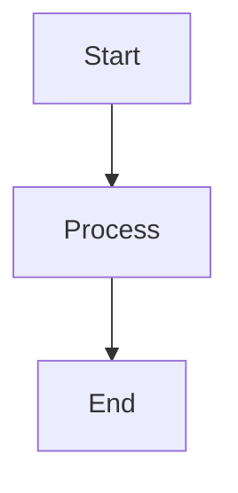
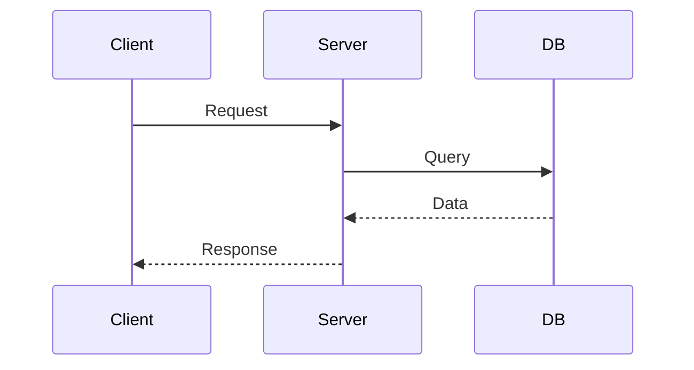
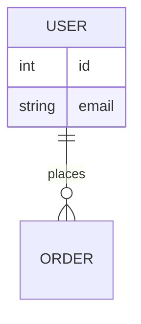

# Documentation Workflow

Complete workflow for creating and maintaining project documentation.

## IMPORTANT: Read Architecture First

**Before writing documentation, you MUST read the appropriate architecture reference:**

### Global Architecture Files
```
~/.claude/architecture/
├── clean-architecture.md    # Core principles for all projects
├── flutter-mobile.md        # Flutter + Riverpod
├── react-frontend.md        # React + Vite + TypeScript
├── go-backend.md            # Go + Gin
├── laravel-backend.md       # Laravel + PHP
├── remix-fullstack.md       # Remix fullstack
└── monorepo.md              # Monorepo structure
```

### Project-specific (if exists)
```
.claude/architecture/        # Project overrides
```

**Documentation must accurately reflect the architecture and patterns used in the codebase.**

## Recommended Agents

| Phase | Agent | Purpose |
|-------|-------|---------|
| SCAN | `@clean-architect` | Identify documentation needs |
| ANALYZE | `@api-designer` | API documentation structure |
| ANALYZE | `@db-designer` | Database documentation |
| GENERATE | `@docs-writer` | Write all documentation |
| REVIEW | `@code-reviewer` | Verify accuracy |
| REVIEW | `@react-frontend-dev`, `@go-backend-dev`, `@laravel-backend-dev`, `@flutter-mobile-dev`, `@remix-fullstack-dev` | Stack-specific review |

## Workflow Overview

```
┌──────────┐   ┌──────────┐   ┌──────────┐   ┌──────────┐
│ 1. SCAN  │──▶│2. ANALYZE│──▶│3. GENERATE──▶│4. REVIEW │
└──────────┘   └──────────┘   └──────────┘   └──────────┘
                                                   │
                                           ┌───────┘
                                           ▼
                                    Feedback Loop
```

---

## Phase 1: SCAN

**Goal**: Scan codebase to identify what needs documentation

### Actions
1. **Identify project stack and read architecture doc**
2. Scan codebase structure based on architecture:
   ```bash
   # List directory structure
   tree -L 3 -I 'node_modules|vendor|dist|build'

   # Find existing docs
   find . -name "*.md" -o -name "README*"

   # Identify API files (based on stack)
   # Flutter: lib/data/api/
   # React: src/api/, src/services/
   # Go: internal/handler/, internal/controller/
   # Laravel: app/Http/Controllers/Api/
   # Remix: app/routes/
   ```

3. Identify documentable items:
   - [ ] README (project overview)
   - [ ] API documentation (endpoints, schemas)
   - [ ] Architecture documentation (system design)
   - [ ] Setup/Installation guides
   - [ ] User guides (how to use features)
   - [ ] Developer guides (how to contribute)
   - [ ] Database schema
   - [ ] Configuration reference
   - [ ] Deployment guides

### Output
```markdown
## Documentation Scan

### Stack & Architecture
- Stack: [Flutter/React/Go/Laravel/Remix/Monorepo]
- Architecture Doc: [path to architecture file]

### Existing Documentation
- [ ] README.md
- [ ] API.md
- [ ] ARCHITECTURE.md
- [ ] CONTRIBUTING.md
- [ ] Other: [list]

### Missing Documentation
- [ ] Item 1
- [ ] Item 2
- [ ] Item 3

### Documentation Priorities (High to Low)
1. [Most critical docs]
2. [Important docs]
3. [Nice-to-have docs]
```

### Gate
- [ ] Architecture doc read
- [ ] Codebase structure understood
- [ ] Documentation gaps identified
- [ ] Priorities set

---

## Phase 2: ANALYZE

**Goal**: Understand what information each document should contain

### Actions
1. **Re-read architecture doc** for documentation standards
2. For each documentation type, analyze content:

   **README Analysis**:
   - Project purpose
   - Tech stack (from architecture)
   - Quick start
   - Installation steps
   - Usage examples
   - Links to other docs

   **API Documentation Analysis**:
   - Identify all endpoints/routes
   - Request/response schemas
   - Authentication requirements
   - Error codes
   - Rate limits
   - Examples

   **Architecture Documentation Analysis**:
   - System overview
   - Layer structure (from architecture doc)
   - Component relationships
   - Data flow patterns
   - Design decisions (ADRs)

   **Developer Guide Analysis**:
   - Project structure (from architecture)
   - Coding standards
   - Testing patterns
   - Git workflow
   - CI/CD pipeline

3. Create documentation outline

### Analysis Output
```markdown
## Documentation Plan

### Reference
- Architecture Doc: [path]
- Stack Patterns: [patterns from doc]

### [Doc Type 1] - e.g., README.md

**Purpose**: [what this doc achieves]

**Audience**: [who reads this]

**Content Outline**:
1. Section 1
   - Subsection A
   - Subsection B
2. Section 2
   - Subsection A
3. Section 3

**Source Information**:
- Files to reference: [list]
- Architecture sections: [sections from doc]
- Example code locations: [paths]

### [Doc Type 2] - e.g., API.md

**Purpose**: [what this doc achieves]

**Audience**: [who reads this]

**Content Outline**:
[similar structure]

**Source Information**:
[similar structure]
```

### Gate
- [ ] Each document has clear purpose
- [ ] Content outlines complete
- [ ] Source information identified
- [ ] Aligned with architecture doc

---

## Phase 3: GENERATE

**Goal**: Write complete, accurate documentation

### Actions
1. **Read architecture doc** for patterns and conventions
2. For each document type, follow templates below
3. Use actual code examples from codebase
4. Follow documentation standards from architecture
5. Ensure all paths, commands, examples are accurate

### Documentation Templates

#### README.md Template
```markdown
# [Project Name]

[One-line description]

## Overview

[2-3 paragraphs describing what this project does and why it exists]

## Tech Stack

Based on [architecture doc reference]:

- **Language**: [language + version]
- **Framework**: [framework + version]
- **Architecture**: [pattern from architecture doc]
- **Database**: [database]
- **Other**: [key dependencies]

## Quick Start

\`\`\`bash
# Clone
git clone [repo-url]

# Install dependencies (use command from architecture doc)
[npm install / go mod download / composer install / flutter pub get]

# Configure
cp .env.example .env
# Edit .env with your settings

# Run (use command from architecture doc)
[npm run dev / go run . / php artisan serve / flutter run]
\`\`\`

## Installation

### Prerequisites
- [prerequisite 1]
- [prerequisite 2]

### Steps
1. [Step 1]
2. [Step 2]
3. [Step 3]

## Project Structure

Based on [architecture doc]:

\`\`\`
[directory tree following architecture doc]
\`\`\`

## Usage

### [Feature 1]
\`\`\`[language]
// Example code
\`\`\`

### [Feature 2]
\`\`\`[language]
// Example code
\`\`\`

## Configuration

See `.env.example` for all configuration options:

| Variable | Description | Default |
|----------|-------------|---------|
| VAR_1 | [description] | [default] |
| VAR_2 | [description] | [default] |

## Development

### Running Tests

\`\`\`bash
# From architecture doc
[test command]
\`\`\`

### Code Style

\`\`\`bash
# From architecture doc
[format/lint commands]
\`\`\`

## Architecture

See `.claude/architecture/[stack].md` for detailed architecture documentation.

**Key Patterns**:
- [Pattern 1 from architecture doc]
- [Pattern 2 from architecture doc]

## API Documentation

See [API.md](./API.md) for complete API reference.

## Contributing

1. Fork the repository
2. Create feature branch: `git checkout -b feature/name`
3. Follow architecture patterns in `.claude/architecture/`
4. Write tests
5. Submit PR

## License

[License information]
```

#### API.md Template
```markdown
# API Documentation

## Overview

[Brief API description]

**Base URL**: `[base_url]`

**Authentication**: [auth method]

## Authentication

### [Auth Method]

\`\`\`http
POST /api/auth/login
Content-Type: application/json

{
  "email": "user@example.com",
  "password": "password"
}
\`\`\`

**Response**:
\`\`\`json
{
  "token": "eyJ...",
  "user": {
    "id": 1,
    "email": "user@example.com"
  }
}
\`\`\`

## Endpoints

### [Resource Name]

#### Get All [Resources]

\`\`\`http
GET /api/[resources]
Authorization: Bearer {token}
\`\`\`

**Query Parameters**:
| Parameter | Type | Required | Description |
|-----------|------|----------|-------------|
| page | integer | No | Page number (default: 1) |
| limit | integer | No | Items per page (default: 10) |
| filter | string | No | Filter criteria |

**Response** (200 OK):
\`\`\`json
{
  "data": [
    {
      "id": 1,
      "field1": "value1",
      "field2": "value2"
    }
  ],
  "meta": {
    "total": 100,
    "page": 1,
    "limit": 10
  }
}
\`\`\`

#### Get Single [Resource]

\`\`\`http
GET /api/[resources]/{id}
Authorization: Bearer {token}
\`\`\`

**Response** (200 OK):
\`\`\`json
{
  "id": 1,
  "field1": "value1",
  "field2": "value2"
}
\`\`\`

#### Create [Resource]

\`\`\`http
POST /api/[resources]
Authorization: Bearer {token}
Content-Type: application/json

{
  "field1": "value1",
  "field2": "value2"
}
\`\`\`

**Request Schema**:
| Field | Type | Required | Description |
|-------|------|----------|-------------|
| field1 | string | Yes | [description] |
| field2 | string | No | [description] |

**Response** (201 Created):
\`\`\`json
{
  "id": 1,
  "field1": "value1",
  "field2": "value2"
}
\`\`\`

#### Update [Resource]

\`\`\`http
PUT /api/[resources]/{id}
Authorization: Bearer {token}
Content-Type: application/json

{
  "field1": "new_value"
}
\`\`\`

**Response** (200 OK):
\`\`\`json
{
  "id": 1,
  "field1": "new_value",
  "field2": "value2"
}
\`\`\`

#### Delete [Resource]

\`\`\`http
DELETE /api/[resources]/{id}
Authorization: Bearer {token}
\`\`\`

**Response** (204 No Content)

## Error Responses

All endpoints may return these errors:

### 400 Bad Request
\`\`\`json
{
  "error": {
    "code": "VALIDATION_ERROR",
    "message": "Validation failed",
    "details": [
      {
        "field": "email",
        "message": "Invalid email format"
      }
    ]
  }
}
\`\`\`

### 401 Unauthorized
\`\`\`json
{
  "error": {
    "code": "UNAUTHORIZED",
    "message": "Invalid or missing authentication token"
  }
}
\`\`\`

### 403 Forbidden
\`\`\`json
{
  "error": {
    "code": "FORBIDDEN",
    "message": "You don't have permission to access this resource"
  }
}
\`\`\`

### 404 Not Found
\`\`\`json
{
  "error": {
    "code": "NOT_FOUND",
    "message": "Resource not found"
  }
}
\`\`\`

### 500 Internal Server Error
\`\`\`json
{
  "error": {
    "code": "INTERNAL_ERROR",
    "message": "An unexpected error occurred"
  }
}
\`\`\`

## Rate Limiting

- **Limit**: [requests per timeframe]
- **Headers**:
  - `X-RateLimit-Limit`: Total requests allowed
  - `X-RateLimit-Remaining`: Requests remaining
  - `X-RateLimit-Reset`: Time when limit resets (Unix timestamp)

## Examples

### cURL

\`\`\`bash
# Login
curl -X POST [base_url]/api/auth/login \\
  -H "Content-Type: application/json" \\
  -d '{"email":"user@example.com","password":"password"}'

# Get resources
curl -X GET [base_url]/api/[resources] \\
  -H "Authorization: Bearer {token}"
\`\`\`

### JavaScript (fetch)

\`\`\`javascript
// Login
const response = await fetch('[base_url]/api/auth/login', {
  method: 'POST',
  headers: { 'Content-Type': 'application/json' },
  body: JSON.stringify({
    email: 'user@example.com',
    password: 'password'
  })
});
const { token } = await response.json();

// Get resources
const resources = await fetch('[base_url]/api/[resources]', {
  headers: { 'Authorization': `Bearer ${token}` }
}).then(r => r.json());
\`\`\`

### [Stack-specific client example]

\`\`\`[language]
// Example using your stack's HTTP client
\`\`\`
```

#### ARCHITECTURE.md Template
```markdown
# Architecture Documentation

## Overview

This project follows [architecture pattern] as defined in `.claude/architecture/[stack].md`.

## System Architecture

### High-Level Diagram

\`\`\`mermaid
graph TB
    Client[Client Layer]
    Presentation[Presentation Layer]
    Business[Business Logic Layer]
    Data[Data Layer]
    External[External Services]

    Client --> Presentation
    Presentation --> Business
    Business --> Data
    Business --> External
    Data --> Database[(Database)]
\`\`\`

### Layers

Based on `.claude/architecture/[stack].md`:

#### 1. [Layer 1 from architecture doc]

**Purpose**: [purpose]

**Components**:
- Component A: [description]
- Component B: [description]

**Location**: `[directory path from architecture]`

**Responsibilities**:
- [ ] Responsibility 1
- [ ] Responsibility 2

#### 2. [Layer 2 from architecture doc]

**Purpose**: [purpose]

**Components**:
- Component A: [description]
- Component B: [description]

**Location**: `[directory path from architecture]`

**Responsibilities**:
- [ ] Responsibility 1
- [ ] Responsibility 2

#### 3. [Layer 3 from architecture doc]

[Similar structure]

## Directory Structure

Following `.claude/architecture/[stack].md`:

\`\`\`
[detailed directory tree with explanations]
\`\`\`

## Data Flow

### [Example Flow - e.g., User Authentication]

\`\`\`mermaid
sequenceDiagram
    participant C as Client
    participant P as Presentation
    participant B as Business
    participant D as Data
    participant DB as Database

    C->>P: POST /api/auth/login
    P->>B: LoginUseCase.execute()
    B->>D: UserRepository.findByEmail()
    D->>DB: SELECT * FROM users
    DB-->>D: User data
    D-->>B: User entity
    B->>B: Validate password
    B->>B: Generate token
    B-->>P: AuthToken
    P-->>C: 200 OK {token}
\`\`\`

**Steps**:
1. [Step 1 explanation following architecture]
2. [Step 2 explanation]
3. [Step 3 explanation]

## Design Patterns

From `.claude/architecture/[stack].md`:

### [Pattern 1 - e.g., Dependency Injection]

**Where**: [layers where used]

**Implementation**:
\`\`\`[language]
// Example from codebase
\`\`\`

### [Pattern 2 - e.g., Repository Pattern]

**Where**: [layers where used]

**Implementation**:
\`\`\`[language]
// Example from codebase
\`\`\`

## Key Components

### [Component 1]

**Type**: [Controller/Service/Repository/etc.]

**Location**: `[file path]`

**Purpose**: [what it does]

**Dependencies**:
- Dependency 1
- Dependency 2

**Interface**:
\`\`\`[language]
// Interface or main methods
\`\`\`

### [Component 2]

[Similar structure]

## Database Schema

### Tables

#### [Table 1]

| Column | Type | Constraints | Description |
|--------|------|-------------|-------------|
| id | integer | PK, AUTO_INCREMENT | Primary key |
| field1 | varchar(255) | NOT NULL | [description] |
| created_at | timestamp | DEFAULT NOW() | Creation time |

**Relationships**:
- Belongs to: [related table]
- Has many: [related table]

#### [Table 2]

[Similar structure]

### ER Diagram

\`\`\`mermaid
erDiagram
    TABLE1 ||--o{ TABLE2 : has
    TABLE1 {
        int id PK
        string field1
    }
    TABLE2 {
        int id PK
        int table1_id FK
        string field2
    }
\`\`\`

## Configuration

### Environment Variables

See `.env.example`:

| Variable | Type | Required | Description | Default |
|----------|------|----------|-------------|---------|
| VAR_1 | string | Yes | [description] | - |
| VAR_2 | integer | No | [description] | 3000 |

### Application Config

Configuration files and their purposes:

- `[config file 1]`: [purpose]
- `[config file 2]`: [purpose]

## Testing Strategy

Based on architecture patterns:

### Unit Tests

**Location**: [path from architecture doc]

**Coverage**: [target percentage]

**Run**: `[test command from architecture]`

\`\`\`[language]
// Example unit test following architecture patterns
\`\`\`

### Integration Tests

**Location**: [path from architecture doc]

**Coverage**: [what's tested]

**Run**: `[test command]`

### E2E Tests

**Location**: [path from architecture doc]

**Coverage**: [what's tested]

**Run**: `[test command]`

## Deployment

### Build

\`\`\`bash
[build commands from architecture]
\`\`\`

### Deploy

\`\`\`bash
[deploy commands]
\`\`\`

### Environments

| Environment | URL | Purpose |
|-------------|-----|---------|
| Development | [url] | Local development |
| Staging | [url] | Pre-production testing |
| Production | [url] | Live application |

## Decision Records (ADRs)

### ADR-001: [Decision Title]

**Date**: [date]

**Status**: [Accepted/Rejected/Superseded]

**Context**: [Why we needed to make this decision]

**Decision**: [What we decided]

**Consequences**: [Impact of this decision]

### ADR-002: [Decision Title]

[Similar structure]

## References

- Architecture Doc: `.claude/architecture/[stack].md`
- [Other relevant docs]
```

#### CONTRIBUTING.md Template
```markdown
# Contributing Guide

## Getting Started

### Prerequisites

- [prerequisite 1]
- [prerequisite 2]

### Setup

1. Fork and clone:
   \`\`\`bash
   git clone [your-fork-url]
   cd [project]
   \`\`\`

2. Install dependencies:
   \`\`\`bash
   [install command from architecture]
   \`\`\`

3. Configure:
   \`\`\`bash
   cp .env.example .env
   # Edit .env
   \`\`\`

4. Run:
   \`\`\`bash
   [run command from architecture]
   \`\`\`

## Architecture

**IMPORTANT**: Read `.claude/architecture/[stack].md` before contributing.

This project follows [architecture pattern]. Key principles:

- [Principle 1 from architecture doc]
- [Principle 2 from architecture doc]
- [Principle 3 from architecture doc]

## Project Structure

Based on `.claude/architecture/[stack].md`:

\`\`\`
[directory structure with explanations]
\`\`\`

## Development Workflow

### 1. Create Branch

\`\`\`bash
git checkout -b feature/your-feature-name
# or
git checkout -b fix/your-bug-fix
\`\`\`

### 2. Make Changes

Follow architecture patterns from `.claude/architecture/[stack].md`:

- **Layer boundaries**: [rules from architecture]
- **Naming conventions**: [conventions from architecture]
- **File organization**: [rules from architecture]

### 3. Write Tests

Test location from architecture doc: `[test directory]`

\`\`\`bash
# Run tests
[test command from architecture]
\`\`\`

**Coverage requirement**: [percentage]

### 4. Code Style

Follow coding standards:

\`\`\`bash
# Format code
[format command from architecture]

# Lint
[lint command from architecture]
\`\`\`

### 5. Commit

Follow [Conventional Commits](https://www.conventionalcommits.org/):

\`\`\`bash
git commit -m "feat: add new feature"
git commit -m "fix: resolve bug in component"
git commit -m "docs: update README"
\`\`\`

**Types**:
- `feat`: New feature
- `fix`: Bug fix
- `docs`: Documentation
- `style`: Code style (formatting)
- `refactor`: Code refactoring
- `test`: Tests
- `chore`: Maintenance

### 6. Push & PR

\`\`\`bash
git push origin feature/your-feature-name
\`\`\`

Create PR with:
- Clear title
- Description of changes
- Reference to issue (if applicable)
- Screenshots (if UI changes)

## Code Standards

### [Language] Style Guide

Based on `.claude/architecture/[stack].md`:

**Naming**:
- Files: `[convention from architecture]`
- Classes: `[convention]`
- Functions: `[convention]`
- Variables: `[convention]`

**Structure**:
\`\`\`[language]
// Example following architecture patterns
\`\`\`

### Documentation

- Document public APIs
- Add comments for complex logic
- Update README if needed

### Testing

**Unit Tests**:
\`\`\`[language]
// Example following architecture test patterns
\`\`\`

**Integration Tests**:
\`\`\`[language]
// Example
\`\`\`

## Pull Request Process

1. **Before submitting**:
   - [ ] Code follows architecture patterns
   - [ ] Tests pass
   - [ ] Code is formatted/linted
   - [ ] Documentation updated
   - [ ] No breaking changes (or documented)

2. **PR template**:
   \`\`\`markdown
   ## Description
   [What does this PR do?]

   ## Type of Change
   - [ ] Bug fix
   - [ ] New feature
   - [ ] Breaking change
   - [ ] Documentation

   ## Architecture Compliance
   - [ ] Follows patterns in .claude/architecture/[stack].md
   - [ ] Layer boundaries respected
   - [ ] Naming conventions followed

   ## Testing
   - [ ] Unit tests added/updated
   - [ ] Integration tests added/updated
   - [ ] All tests pass

   ## Checklist
   - [ ] Code formatted
   - [ ] Documentation updated
   - [ ] No console.log/debug code
   \`\`\`

3. **Review process**:
   - Maintainer reviews
   - CI/CD checks pass
   - Approved → Merged

## Common Tasks

### Adding a New Feature

Follow `.claude/architecture/[stack].md`:

1. **[Layer 1 from architecture]**: Create [component type]
2. **[Layer 2 from architecture]**: Create [component type]
3. **[Layer 3 from architecture]**: Create [component type]
4. Write tests
5. Update documentation

### Fixing a Bug

1. Identify affected layer (from architecture)
2. Write failing test
3. Fix bug
4. Verify test passes
5. Check no regressions

### Refactoring

1. Ensure tests exist
2. Refactor following architecture patterns
3. Verify tests still pass
4. Document why refactored

## Questions?

- Read: `.claude/architecture/[stack].md`
- Check: [ARCHITECTURE.md](./ARCHITECTURE.md)
- Ask: [contact/discussion link]
```

### Gate
- [ ] All planned documents generated
- [ ] Follow architecture patterns
- [ ] Code examples are accurate
- [ ] All links work
- [ ] Formatting correct

---

## Phase 4: REVIEW

**Goal**: Verify documentation accuracy and completeness

### Actions
1. **Compare with architecture doc**:
   - [ ] Documentation reflects actual architecture
   - [ ] Patterns described match code
   - [ ] Directory structures match
   - [ ] Examples use correct patterns

2. **Verify accuracy**:
   - [ ] All commands work
   - [ ] All code examples compile/run
   - [ ] All file paths exist
   - [ ] All links resolve
   - [ ] Environment variables correct

3. **Check completeness**:
   - [ ] All sections filled in
   - [ ] No TODO markers left
   - [ ] All endpoints documented (API docs)
   - [ ] All features explained (README)

4. **Test documentation**:
   - [ ] Follow README from scratch
   - [ ] Try all code examples
   - [ ] Verify installation steps
   - [ ] Test API examples

5. **Review checklist**:
   - [ ] Clear and concise
   - [ ] Appropriate for audience
   - [ ] No jargon (or explained)
   - [ ] Consistent formatting
   - [ ] Proper grammar/spelling

### Review Output
```markdown
## Documentation Review

### Architecture Compliance: [Pass/Fail]
- Reference: [architecture doc]
- Issues: [list any mismatches]

### Accuracy: [Pass/Fail]
- Commands tested: [results]
- Code examples tested: [results]
- Links verified: [results]
- Issues: [list]

### Completeness: [Pass/Fail]
- Missing sections: [list]
- TODOs remaining: [count]
- Issues: [list]

### Quality: [Good/Needs Work]
- Clarity: [assessment]
- Audience fit: [assessment]
- Issues: [list]

### Recommendations
1. [Recommendation 1]
2. [Recommendation 2]
```

### Gate
- [ ] Documentation matches architecture
- [ ] All examples verified
- [ ] No broken links
- [ ] Quality acceptable

### Feedback Loop
If issues found:
1. Note specific problems
2. Return to GENERATE phase
3. Fix issues
4. Re-review

---

## Quick Reference

### Architecture Docs
| Stack | Doc |
|-------|-----|
| All | `clean-architecture.md` |
| Flutter | `flutter-mobile.md` |
| React | `react-frontend.md` |
| Go | `go-backend.md` |
| Laravel | `laravel-backend.md` |
| Remix | `remix-fullstack.md` |
| Monorepo | `monorepo.md` |

### Documentation Types

| Type | File | Purpose | Priority |
|------|------|---------|----------|
| Project Overview | README.md | First impression, quick start | High |
| API Reference | API.md | Endpoint documentation | High |
| Architecture | ARCHITECTURE.md | System design, patterns | Medium |
| Contributing | CONTRIBUTING.md | Contribution guidelines | Medium |
| Setup Guide | SETUP.md | Detailed installation | Medium |
| User Guide | GUIDE.md | Feature tutorials | Low |
| Changelog | CHANGELOG.md | Version history | Low |

### Phase Summary
| Phase | Key Actions | Output |
|-------|-------------|--------|
| SCAN | Read architecture, identify gaps | Documentation gap list |
| ANALYZE | Plan content, create outlines | Documentation plan |
| GENERATE | Write docs using templates | Complete documentation |
| REVIEW | Verify accuracy, test examples | Review report |

### Doc Templates Quick Access

**README**: Project overview, quick start, usage
**API**: Endpoints, schemas, examples, errors
**ARCHITECTURE**: System design, layers, patterns, data flow
**CONTRIBUTING**: Setup, workflow, standards, PR process

### Verification Checklist

Before completing documentation:

**Technical Accuracy**:
- [ ] All commands work
- [ ] All paths exist
- [ ] All code compiles
- [ ] All examples run

**Architecture Alignment**:
- [ ] Reflects actual architecture
- [ ] Uses correct patterns
- [ ] Follows conventions
- [ ] Matches directory structure

**Completeness**:
- [ ] All sections complete
- [ ] No TODOs left
- [ ] All features documented
- [ ] All APIs documented

**Quality**:
- [ ] Clear and concise
- [ ] Consistent formatting
- [ ] Proper grammar
- [ ] Links work

### Common Documentation Patterns

**Stack-Specific Commands**:

| Stack | Install | Run | Test | Format |
|-------|---------|-----|------|--------|
| Flutter | `flutter pub get` | `flutter run` | `flutter test` | `dart format .` |
| React | `npm install` | `npm run dev` | `npm test` | `npm run format` |
| Go | `go mod download` | `go run .` | `go test ./...` | `go fmt ./...` |
| Laravel | `composer install` | `php artisan serve` | `php artisan test` | `./vendor/bin/pint` |
| Remix | `npm install` | `npm run dev` | `npm test` | `npm run format` |

### Mermaid Diagram Types

**Flowchart**: System architecture, data flow


**Sequence**: API flow, request/response


**ER Diagram**: Database schema


---

## Tips

1. **Always read architecture doc first** - Documentation must match reality
2. **Test everything** - Run all commands, examples before publishing
3. **Use real examples** - Extract from actual codebase, not invented
4. **Keep it updated** - Documentation rots fast, update with code changes
5. **Target the audience** - README for users, CONTRIBUTING for developers
6. **Link liberally** - Cross-reference between docs
7. **Show, don't tell** - Examples > explanations
8. **Be consistent** - Same terminology, formatting throughout

## Success Criteria

Documentation is complete when:
1. Follows architecture patterns from doc
2. All commands verified working
3. All code examples tested
4. New contributor can onboard using docs
5. API user can integrate using docs
6. No broken links or TODOs
7. Reviewed and approved
