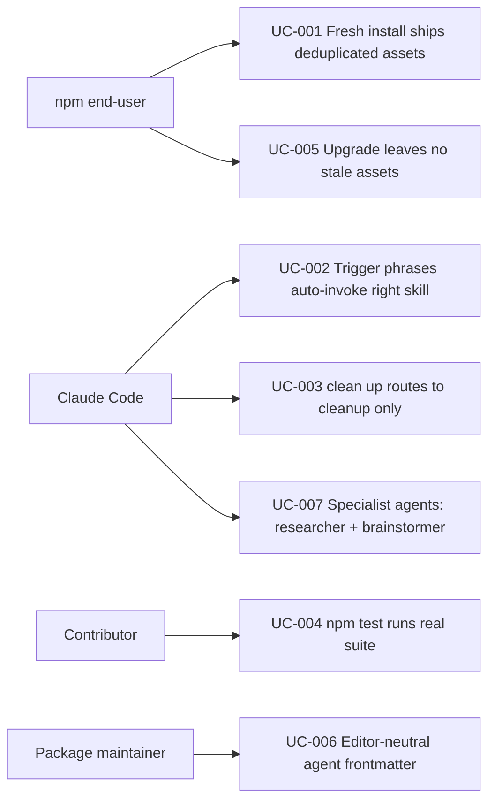

# Use Case Diagram

- Actors: npm end-user, Claude Code, Contributor, Package maintainer
- Use cases: UC-001, UC-002, UC-003, UC-004, UC-005, UC-006, UC-007
- Relationships: end-user drives install/upgrade flows; Claude Code drives auto-invocation + specialist agent flows; Contributor drives test flow; maintainer owns asset neutrality
